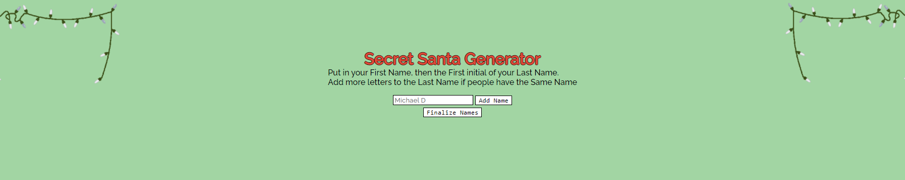

# Secret Santa Generator

[Github](https://github.com/evan-ebert17/SecretSanta/)  
[Deployed App](https://evan-ebert17.github.io/SecretSanta/)

## Screen Shots

##### Table of Contents  
[Purpose](#purpose)  
[Features](#features)  
[Technologies Used](#technologies-used)  
[Installation](#installation)  
[Usage](#usage)  
[Credits](#credits)  
[License](#license)  

## Purpose  
This is an app I made for my friends and I to use for picking names for Secret Santa.

## Features 
The user can put in as many names as they want, hit submit, and will get a random person when they put their name in to be their Secret Santa recipient.

## Technologies-Used  
This project was made possible with JavaScript, HTML5+CSS.  

## Installation  
There is no need to install this application for use, because it is hosted at the links provided above. However, for code inspection or etc, if you have SSH Keys linked, you can simple use your terminal and clone the repo down, otherwise, the typical zip.

## Usage  
Most of the instructions are inside the app itself, but you put your name in (needs to be unique, which is why I reccomended you put your first and last name in) click next for each name entry. Once you have all the entries you want, you are taken to a second section where the person who is currently getting someone to give a gift to would put their name that they had had put in earlier, and then it gives a random name from the list, and then disappears 5 seconds later, so that the next person who comes up to get a name for Secret Santa wont know the previous recipient.

## Credits
This project was made by  
[Evan Ebert](https://github.com/evan-ebert17)

## License

Copyright 2021 Evan Ebert

Permission is hereby granted, free of charge, to any person obtaining a copy of this software and associated documentation files (the "Software"), to deal in the Software without restriction, including without limitation the rights to use, copy, modify, merge, publish, distribute, sublicense, and/or sell copies of the Software, and to permit persons to whom the Software is furnished to do so, subject to the following conditions:

The above copyright notice and this permission notice shall be included in all copies or substantial portions of the Software.

THE SOFTWARE IS PROVIDED "AS IS", WITHOUT WARRANTY OF ANY KIND, EXPRESS OR IMPLIED, INCLUDING BUT NOT LIMITED TO THE WARRANTIES OF MERCHANTABILITY, FITNESS FOR A PARTICULAR PURPOSE AND NONINFRINGEMENT. IN NO EVENT SHALL THE AUTHORS OR COPYRIGHT HOLDERS BE LIABLE FOR ANY CLAIM, DAMAGES OR OTHER LIABILITY, WHETHER IN AN ACTION OF CONTRACT, TORT OR OTHERWISE, ARISING FROM, OUT OF OR IN CONNECTION WITH THE SOFTWARE OR THE USE OR OTHER DEALINGS IN THE SOFTWARE.
